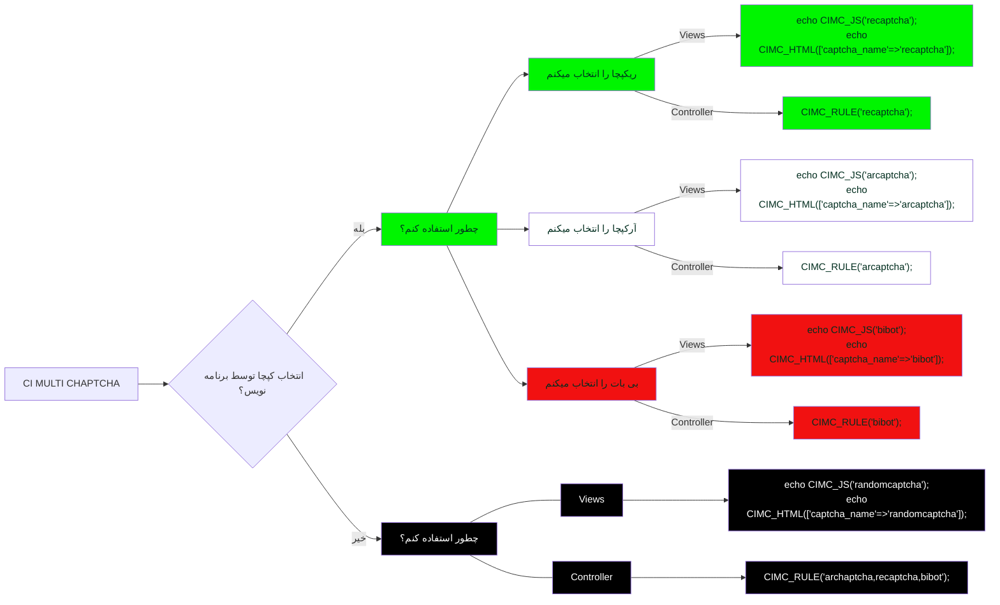

[English](./README.md) | فارسی
# پکیج CI Multi Captcha(CIMC)
این پکیج برای فریم ورک کُدایگنایتر نسخه 4 به بالا قابل استفاده است. این پکیج از سه سرویس کپچا پشتیبانی میکند،شامل سرویس آرکپچا(سرویس حرفه ای کپچا،شامل حدس تصویر،پازل و ... ساخت ایران)، بی بات(سرویس کپچای پازلی ساخت ایران) و ریکپچا(ساخت گوگل). استفاده کننده از این پکیج میتواند مشخص کند که از کدام کپچا استفاده شود و یا مشخص کند که به صورت تصادفی یک کپچا انتخاب شود.


# آموزش تصویری نصب و راه اندازی
ما اینجا آموزش های مربوط به راه اندازی، نصب و نحوه استفاده صحیح از این پکیج را قرار میدهیم.برای اطلاع از روش صحیح استفاده از این پکیج لطفا اقدام به تماشایی ویدیو های آپلود شده کنید.
[ویدیوهای آموزشی در آپارات](https://www.aparat.com/playlist/1509312)
# روش نصب بر روی فریم ورک کُدایگنایتر
ابتدا آخرین نسخه از پکیج را از [دانلود]( https://github.com/datamweb/CodeIgniter-Multi-Captcha/zipball/4) دریافت کنید.
سپس فایل فشرده دانلود شده را در مسیر ```app/ThirdParty``` اکسترکت کنید.
اکنون به مسیر ```app/Config``` بروید. و مورد زیر را در فایل ```Autoload.php``` اضافه کنید و فایل را ذخیره کنید.
```
    public $psr4 = [
	//Add this line
        'CIMC' 	        => APPPATH . 'ThirdParty\CIMultiCaptcha',
    ];
    
```
در گام بعد به مسیر ```app/Config``` بروید در فایل ```Validation.php``` مقادیر زیر را اضافه کنید.

```
    public $ruleSets = [
        // Add this line
        '\CIMC\Validation\RulesCIMC',
    ];
    public $templates = [
        // Add this line
        'CIMC_ERRORS_LIST'      => 'CIMC\Validation\Views\_list.php',
        // Add this line
        'CIMC_ERRORS_SINGLE'    => 'CIMC\Validation\Views\_single.php',
    ];
    
```
# فایل پیکر بندی پکیج
پیش از استفاده از این پکیج شما نیازمند دریافت دو کلید اختصاصی از هر یک از سرویس دهنده های کپچا هستید.به منظور دریافت کلید ها شما باید نسبت به ثبت نام در هر یک از سرویس دهنده های کپچا و نسبت به دریافت کلید ها اقدام کنید. برای دریافت کلید های سرویس آرکپچا به آدرس [ثبت نام آرکپچا]( https://arcaptcha.ir/sign-up)
 ، برای دریافت کلید های بی بات به آدرس [ثبت نام بی بات](https://bibot.ir/panel/user/signup/)
 و برای دریافت کلید های ریکپچا به آدرس [ثبت نام ریکپچا](https://www.google.com/recaptcha/admin/create)بروید.مراحل ثبت نام را طی و نسبت به ثبت دامنه وب سایت خود و دریافت کلید ها اقدام کنید.
  سپس به مسیر ```app/ThirdParty/CIMultiCaptcha/Config``` بروید و مقادیر کلید های```site_key``` و ```secret_key``` مربوطه را در فایل ```MultiCaptchaCIConfig.php``` جایگزین کنید.
در صورت نیاز به تغییر رنگ،تم،اندازه و ... از طریق همین فایل اقدام کنید.
در خصوص زبان کپچا، پکیج به صورت پیشفرض هر زبانی که در فریم ورک تنظیم شده باشد را مد نظر قرار میدهد و کپچا را با همان زبان نمایش میدهد.در صورتی که نیاز به تنظیم سفارشی زبان کپچا دارید از طریق همین فایل مقادیر```lang``` را تنظیم کنید.نکته مهم در این خصوص دو سرویس دهنده ایرانی (آرکپچا و بی بات) تنها از دو زبان فارسی(fa) و انگلیسی (en) پشتیبانی میکنند، این محدودیت مربوط به سرویس دهنده های کپچا میباشند نه پکیج


# روش استفاده از (CIMC)
به طور کلی نحوه استفاده از این پکیج به دو صورت خواهد بود. روش اول انتخاب سرویس توسط برنامه نویس انجام شود،برای مثال برنامه نویس قصد دارد فقط از سرویس ریکپچا استفاده کند بنابراین باید طبق نمودار زیر مسیر سبزرنگ را طی کند.مورد بعدی برنامه نویس در مشخص کردن سرویس نقشی ندارد و سیستم به صورت تصادفی یکی از سرویس ها را انتخاب میکند، برای این کار باید مسیر مشکی رنگ را طی کنید.

# برای بهتر شدن
این پکیج به صورت منبع باز ارائه شده است.در صورتی که نیاز به گفتگو ،مطرح کردن ایده و ... دارید از طریق [گفتگو](https://github.com/datamweb/CodeIgniter-Multi-Captcha/discussions) اقدام کنید.همچنین در صورت وجود باگ، لطفا از طریق [گزارش باگ](https://github.com/datamweb/CodeIgniter-Multi-Captcha/issues) اقدام به ثبت موضوع کنید ما قطعا پاسخگوی شما خواهیم بود.
در صورتی که برنامه نویس هستید لطفا برای بهتر شدن نسبت به مشارکت در کد نویسی از طریق [توسعه پکیج](https://github.com/datamweb/CodeIgniter-Multi-Captcha/pulls) اقدام کنید. ما برای بهتر شدن به تک تک شما نیازمندیم.

# حمایت مالی
نقطه آغازپروژه های منبع باز و دلیل ایجاد انها معمولا نیاز،علاقه و عشق توسعه دهنده به پروژه است. معمولا انتظار درآمدی خاص از آنها وجود ندارد. حقیقت این است که با توجه به پروژه مورد نظر ممکن است ساعت ها،روزها و شاید هم سالها زمان سپری شود تا سر آخر پروژه مورد نظر به مطلوبیت عام برسد و یا شکست بخورد، آنچه در اینجا مهم است زمان و تخصصی است که توسط توسعه دهندگان آنها بدون چشم داشت مالی صرف شده است . در کشور عزیزمان ایران این موضوع باب نشده است که نسبت به پرداخت هزینه استفاده از نرم افزارها،اپلیکیشنها و ... اقدام کنیم،با این حال در صورتی که تمایل به حمایت مالی داشته باشید میتوانید از لینک زیر نسبت به پرداخت وجه به صورت آنلاین اقدام کنید.پیشاپیش از شما ممنونم.
[حمایت مالی از طریق پی](https://me.pay.ir/datamweb)

[حمایت مالی از طریق زرین پال](https://zarinp.al/datamweb)


