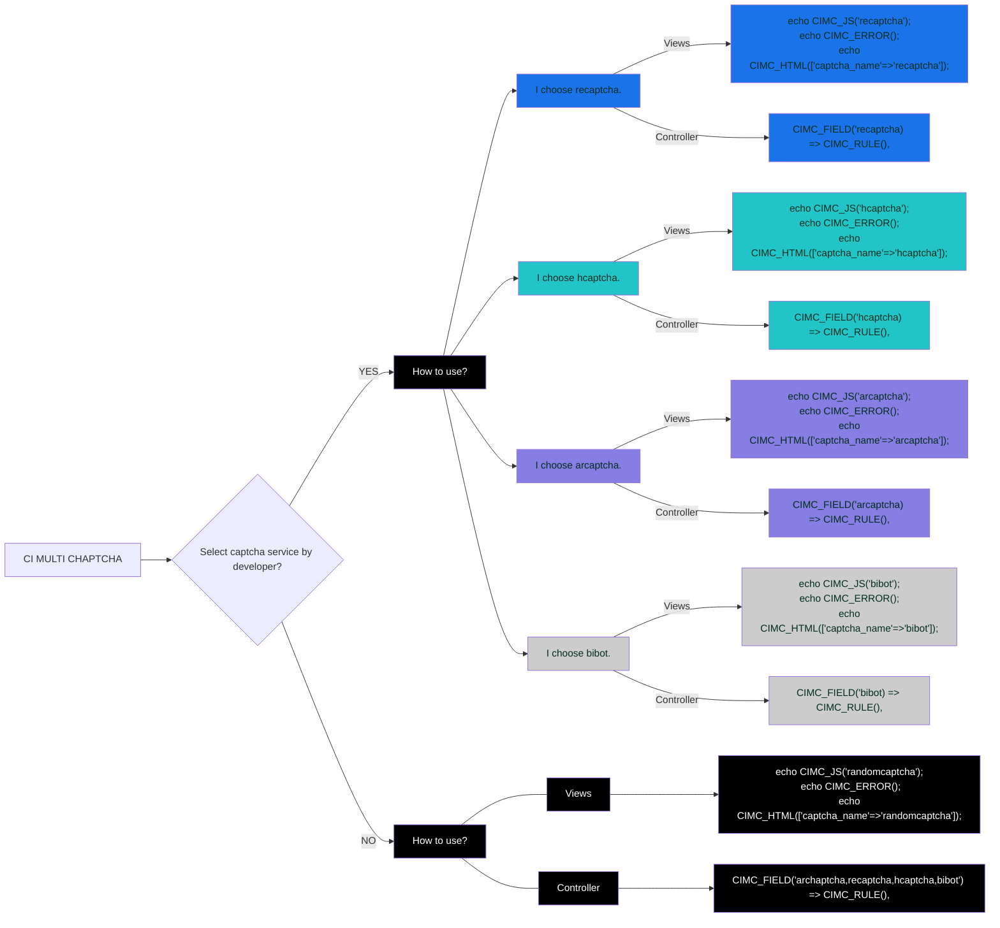

[Farsi](./README.fa-IR.md) | English
# CI Multi Captcha(CIMC)
This package can be used for Codigniter Framework version 4 and above. This package supports 4 captcha services, including Arcaptcha service (professional captcha service, including image guessing, puzzles, etc. made in Iran), Bibot (puzzle captcha service made in Iran), Recaptcha (made by Google) and hCaptcha. The user of this package can specify which captcha to use or specify that a captcha be selected at random. support with rate limiting.


# Installation video tutorial
Here are tutorials on setting up, installing and how to use this package properly. For information on how to use this package correctly, please watch the uploaded videos. 
[tutorials videos in Youtube](https://www.youtube.com/playlist?list=PLOEdZeL7OZ3wudP8ajlXZD_1Lf_qv6pAb)

# How to install on the Codigniter framework
### The first method: by composer
Installation is best done via Composer. Assuming Composer is installed globally, you may use the following command:

```
composer require datamweb/codeIgniter-multi-captcha:dev-main
```

### The second method: manually
First, [download](https://github.com/datamweb/CodeIgniter-Multi-Captcha/releases) the latest version of the package. Then extract the downloaded zip file in the ```app/ThirdParty``` path. Now go to ```app/Config``` . Add the following to the ```Autoload.php``` file and save the file.
```
    public $psr4 = [
	//Add this line
        'Datamweb\CIMC' 	        => APPPATH . 'ThirdParty\CIMultiCaptcha',
    ];
    
```
In the next step, go to the ```app/Config``` path and add the following values in the ```Validation.php``` file.

```
    public $ruleSets = [
        // Add this line
        '\Datamweb\CIMC\Validation\RulesCIMC',
    ];
    public $templates = [
        // Add this line
        'CIMC_ERRORS_LIST'      => 'Datamweb\CIMC\Validation\Views\_list.php',
        // Add this line
        'CIMC_ERRORS_SINGLE'    => 'Datamweb\CIMC\Validation\Views\_single.php',
    ];
    
```

In the next step, go to the ```app/Config``` path and add the following values in the ```Filters.php``` file.
Note:: This feature is supported from version V1.0.2pre-alpha onwards. With this feature you can enable RateLimit. Activity rate limit parameters can be edited through file ```app/ThirdParty/CIMultiCaptcha/Config/MultiCaptchaCIConfig.php```.
Rate limiting is often employed to stop bad bots from negatively impacting a website or application. Bot attacks that rate limiting can help mitigate include:Brute force attacks,DoS and DDoS attacks,Web scraping.
[More info about rate Limit](https://www.cloudflare.com/learning/bots/what-is-rate-limiting/).

```
    public $aliases = [
        //add for mix rate limit and captcha
        'rate_limit_by_captcha' => \Datamweb\CIMC\Filters\RateLimitByCaptcha::class,
    ];
    public $filters = [
        //add for mix rate limit and captcha in all url
        'rate_limit_by_captcha' => ['before' => ['/*']]
    ];
    
```
Demo Rate Limiting :: number_of_action : 5 ,captcha_name: hcaptcha


The default activity rate parameters in file ```MultiCaptchaCIConfig.php``` are as follows, you can decide to false or change at any time.

```
    public $rateLimit=[
        'rate_limit_on'                         =>   true,                              //(true | false)
        'number_of_action'                      =>   25,                                //number of tokens the bucket holds
        'refill_period'                         =>   HOUR,                              //amount of time it takes the bucket to refill (SECOND |MINUTE|HOUR|DAY|WEEK|MONTH|YEAR|DECADE)
        'captcha_name'                          =>   'recaptcha',                       //The name of the captcha used on the Rate Limit page. (arcaptcha|recaptcha|hcaptcha|bibot)
        'rate_limit_view'                       =>   'Datamweb\CIMC\Views\rate_limit',           //The view of used on the Rate Limit page.
    ];
    
```

# Package configuration file
Before using this package, you need to receive two dedicated keys from each of the Captcha servers. In order to receive the keys, you must register in each of the Captcha servers and receive the keys. for receive Arcaptcha service keys to [Arcaptcha registration address](https://arcaptcha.ir/sign-up) , for receive Bibot keys to [Bibot registration address](https://bibot.ir/panel/user/signup/), for receive recaptcha keys to [Recaptcha registration address](https://www.google.com/recaptcha/admin/create) and for receive hcaptcha keys to [hCaptcha registration address](https://hCaptcha.com/?r=e4b628e9c617) . Get the keys to act. Then go to a ```app/ThirdParty/CIMultiCaptcha/Config``` and replace the relevant ```site_key``` and ```secret_key``` keys in the ```MultiCaptchaCIConfig.php``` file. If you need to change the color, theme, size and... proceed through this file. In the case of the captcha language, the package defaults to any language set in the CI framework and displays the captcha in the same language. If you need to customize the captcha language, set the ```lang``` values through this file. Important point in this regard, the two Iranian servers (Arcaptcha and Bibot) support only two languages Persian (fa) and English (en), this restriction is related to captcha servers and not the package.
# How to use (CIMC)
In general, how to use this package will be in two ways. The first method is to select the service by the programmer, for example, the programmer intends to use only the recaptcha service, so he must follow the blue path according to the diagram below. The next item is the programmer has no role in specifying the service. The system randomly selects one of the services, to do this you have to follow the black path.

# To improve
This package is provided as an open source. If you need to talk, come up with an idea, etc. via [discussions](https://github.com/datamweb/CodeIgniter-Multi-Captcha/discussions) Also, if there is a bug, please register via [issues](https://github.com/datamweb/CodeIgniter-Multi-Captcha/issues) .
If you are a programmer, please try to better participate in coding through [pulls](https://github.com/datamweb/CodeIgniter-Multi-Captcha/pulls) . We need each and every one of you to improve.
