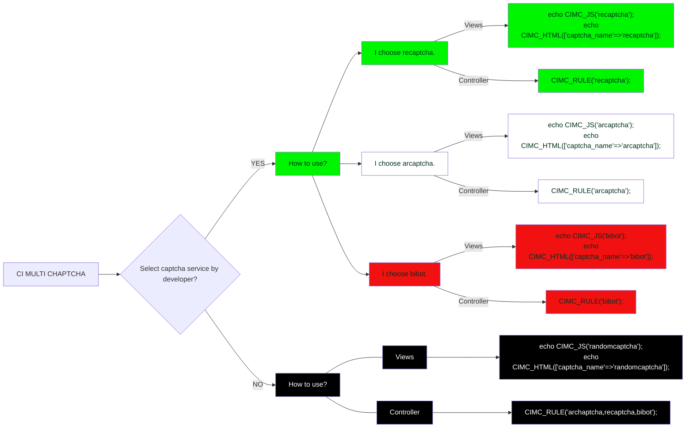

[Farsi](./README.fa-IR.md) | English
# CI Multi Captcha(CIMC)
 CI Multi Captcha(CIMC) is a service for captcha in CodeIgniter4.x framework. CIMC support arcaptcha(A free and professional Iranian product),bibot(A free Iranian product) and recaptcha(An googel product)).

